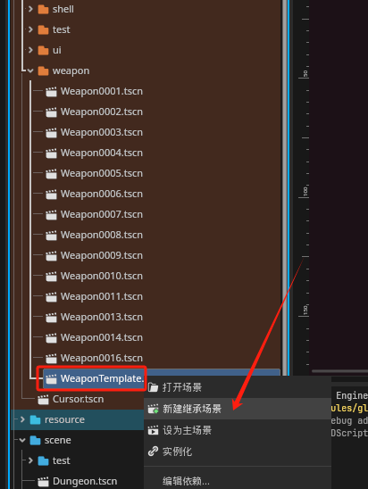
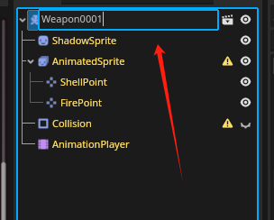
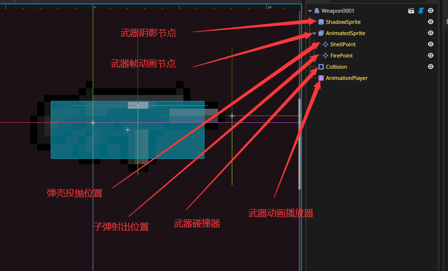
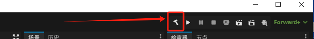
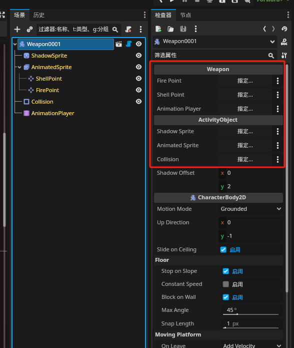
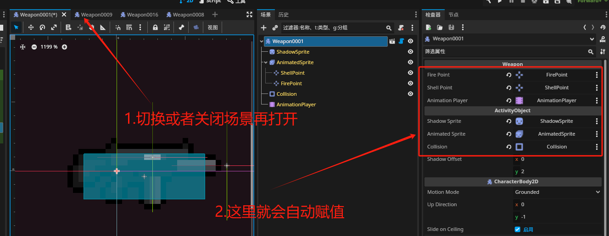
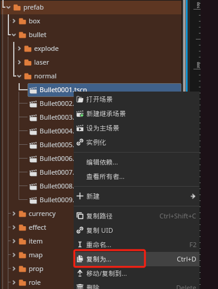
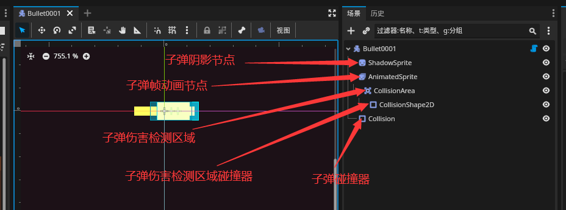
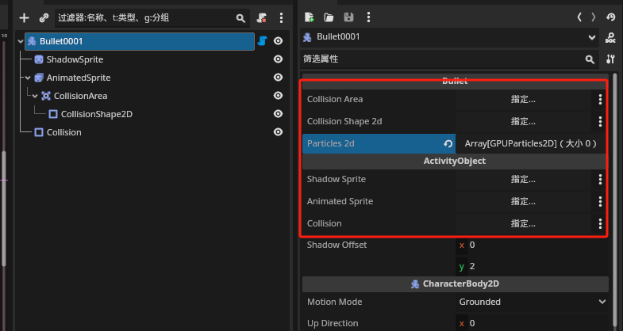

## 武器制作流程


创建一把武器分为以下步骤

1. 创建武器预制体和武器脚本
2. 创建子弹预制体和子弹脚本
3. 在配置表中配置武器和子弹, 并配置武器和子弹的属性


#### 1.创建武器预制体和武器脚本

武器预制体(场景)路径: `res://prefab/weapon/`

首先创建一个武器预制体, 右键`res://prefab/weapon/WeaponTemplate.tscn`, 选择`新建继承场景`



创建完成后需要修改武器场景根节点名称

**武器命名规范**: Weapon+武器唯一Id

这个`武器唯一Id`就是填在配置表中的id, 后面会讲到, **这里先确保唯一即可**



以下是武器所有的节点



所有节点详细描述和注意事项:

- **ShadowSprite**: 武器的阴影节点, 默认`texture`是空的, 游戏会自动根据`AnimatedSprite`节点当前帧创建对应的阴影序列帧, 如果需要自定义阴影纹理, 例如一个阴影圈, 那么就可以手动给`texture`属性赋值
- **AnimatedSprite**: 武器帧动画节点, 模板武器不包含`sprite_frames`数据, 需要自己创建
- **ShellPoint**: 弹壳投抛位置, 手动移动到合适位置即可
- **FirePoint**: 子弹射出位置, 手动移动到合适位置即可
- **Collision**: 武器碰撞器, `shape`默认为空, 必须创建`RectangleShape2D`(矩形)类型碰撞器
- **AnimationPlayer**: 武器动画播放器, 可以创建武器自定义动画, 例如, 换弹, 上膛, 空闲动画等, 动画播放器默认包含`floodlight`动画, 该动画为武器在地上时的高亮动画, 请不要编辑或者删除


接下来就是创建武器脚本, 武器基类为`Weapon`(路径:`src/game/activity/weapon/Weapon.cs`), 并且`Weapon`为抽象类, 因此我们需要创建一个子类并继承`Weapon`

我们创建一个`MyGun.cs`, (如果不想自己实现武器逻辑, 可以直接跳过这一步, 并使用默认的枪类实现: `Gun`, 路径: `src/game/activity/weapon/gun/Gun.cs`)

```csharp
using Godot;

[Tool] //这个[Tool]必须添加, 否则将会在运行游戏时报错!
public partial class MyGun : Weapon
{
    protected override void OnFire()
    {
        //单次开火时调用的函数
    }

    protected override void OnShoot(float fireRotation)
    {
        //发射子弹时调用的函数, 每发射一枚子弹调用一次, 如果做霰弹武器效果, 一次开火发射5枚子弹, 则该函数调用5次
        //fireRotation – 开火时枪口旋转角度, 弧度制
    }
}
```

至于开火和发射子弹的具体逻辑, 这里不过多介绍, 请参照`Gun`类

写完脚本后我们需要点击`Godot`右上角的编译按钮



编译完成后就可以将`MyGun`挂载到武器根节点下了(如果使用默认枪逻辑, 直接挂载`Gun`脚本即可)

刚挂载脚本下面导出的属性都时空的, 不要害怕, 这一步不需要手动赋值

**注意**: 如果挂载脚本后没有出现以下属性, 说明脚本编译出错或者没有编译脚本



这里需要手动关闭场景再打开或者切换到其它页签再切回来, 导出的属性就会自动赋值, 最后记得`ctrl+s`保存一下



到这里武器预制体创建完成


#### 2.创建子弹预制体和子弹脚本

子弹预制体路径: `res://prefab/bullet/`

该文件夹目前包含三个子文件夹, 分别对应三种子弹类型

- **normal**: 正常子弹类型, 实体子弹
- **laser**: 激光
- **explode**: 爆炸效果


我们以最基础的`normal`子弹为例

子弹不像武器有模板场景, 需要自由发挥, 但是我们可以直接复制其它子弹预制体, 然后改个名称即可



子弹命名方式和武器类似, 这里按照其它子弹照葫芦画瓢即可

以下是子弹所有的节点(我们是复制的`Bullet0001.tscn`场景, 其它子弹场景可能会有所不同)



所有节点详细描述和注意事项:

- **ShadowSprite**: 同武器介绍
- **AnimatedSprite**: 同武器介绍
- **CollisionArea**: 子弹伤害检测区域, 检测子弹撞到的目标, 并调用目标的`IHurt.Hurt()`函数, 目标必须实现`IHurt`接口
- **CollisionShape2D**: 子弹伤害碰撞器检测区域, 建议这个区域比`Collision`稍微大一点, 大一点点即可
- **Collision**: 同武器介绍, 但是需要注意的是和`CollisionShape2D`的区别, `CollisionShape2D`是用于子弹击中目标检测的碰撞器, 而该节点为子弹运动的碰撞器, 这个是检测墙壁并反弹的, 这里不要搞混了

> 到这里你就会发现, 武器和子弹都包含了 **ShadowSprite**, **AnimatedSprite** 和 **Collision** 这三个节点, 那是因为这三个节点是`ActivityObject`类提供的, 而武器和子弹都是`ActivityObject`的子类, 因为游戏中基本上所有的实体物体都是`ActivityObject`或者子类

接下来创建子弹脚本, 子弹没有硬性要求必须继承哪个父类, 相反, 它只需要实现`IBullet`接口即可(路径: `src/game/activity/bullet/normal/IBullet.cs`)

但是我们上面的操作复制的是`Bullet0001.tscn`场景, 该场景为`ActivityObject`场景, 所以我们的代码需要继承`ActivityObject`

子弹的实现非常复杂, 非常不建议自己从0开始实现, 直接抄作业使用现成的类`Bullet`(路径: `src/game/activity/bullet/normal/Bullet.cs`)

如果你非得头铁完全自己实现子弹逻辑, 那么有请, 已经起好了开头:

```csharp
[Tool]
public partial class MyBullet : ActivityObject, IBullet
{
```

最后将脚本挂载到场景根节点即可

和武器一样, 这里会有几个引用需要复制



复制的流程也和武器一样, 要手动关闭场景再打开或者切换到其它页签再切回来, 自动赋值完成, 最后记得保存

子弹制作完成


**Tips**: `laser(激光)`和`explode(爆炸)`并不是`ActivityObject`, 它们是由其它Godot原生节点实现的, 具体实现直接看它们挂载的脚本即可, 前提先把`normal`类型的子弹玩明白


#### 3.在配置表中配置武器和子弹, 并配置武器和子弹的属性

