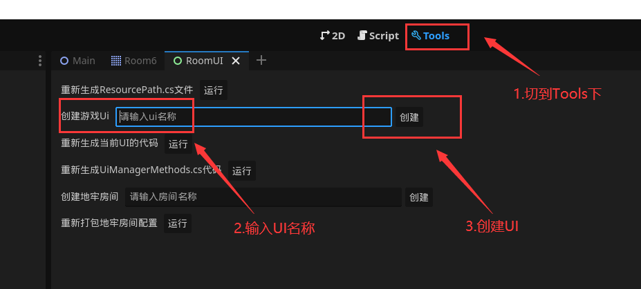
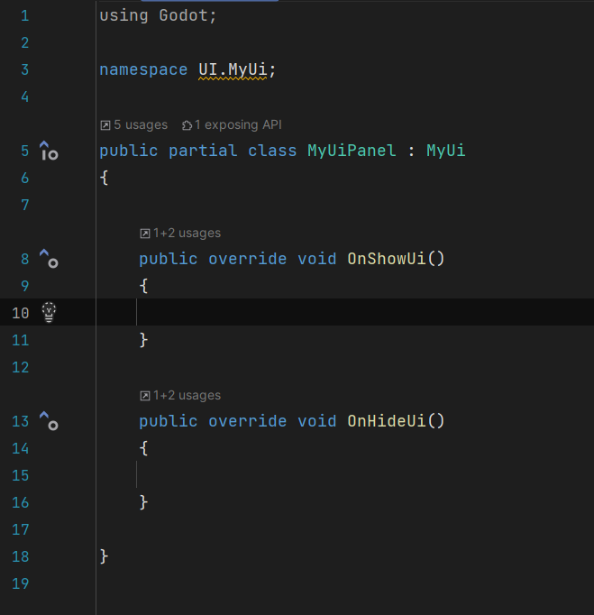
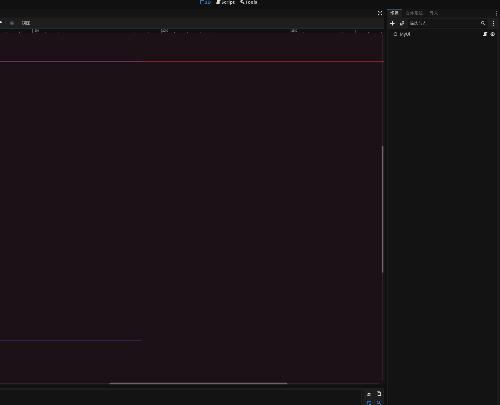
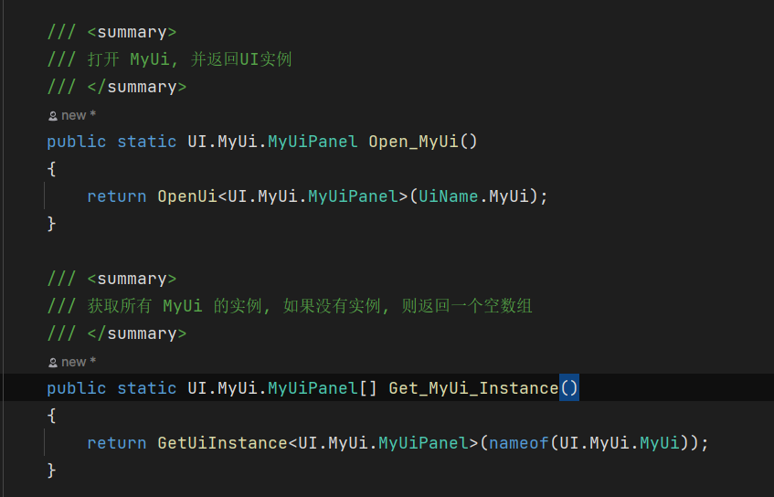

前言: 该文档仅针对`DungeonShooting_Godot`目录下的Godot工程

**注意:** 新版文档编写中...

目录:

---
## 1.启动项目
**Godot版本:** Godot4x   
**.net版本:** .net6.0  
使用Godot打开`project.godot`, 如果是第一次打开项目会弹出一个找不到资源的提示, 这是因为项目没有编译过, 点击Godot右上角`build`, 然后打`开项目设置`, 在`插件`这一个页签下启用`DungeonShooting_plugin`这个插件, 然后项目就可以正常运行了

---
## 2.项目资源

### 2.1.目录结构
所有资源严格划分类别, 并放入指定的文件夹  
**项目目录结构如下:**
* ./addons: 项目插件目录  
* ./prefab: 预制体资源目录  
* ./resource 美术,音乐,配置文件等资源放置路径  
* ./scene 场景资源  
* ./src 代码资源

### 2.2.脚本获取资源
为了方便代码获取资源以及排除代码中引用丢失资源的情况, 项目中使用`ResourcePath`类来放置所有资源路径, 该类常量值即代表资源路径, 使用`ResourceManager.Load()`来加载资源  
举个例子, 某资源在编辑器中的路径为: 
```text
res://resource/theme/mainTheme.tres
```
那么在`ResourcePath`中的代码就为:
```csharp
public const string resource_theme_mainTheme_tres = "res://resource/theme/mainTheme.tres";
```
加载该资源的代码为:
```csharp
var resource = ResourceManager.Load<Theme>(ResourcePath.resource_theme_mainTheme_tres);
```

### 2.3.重新生成ResourcePath
如果项目中有资源变动, 则可以使用`Tools`页签下的`重新生成ResourcePath.cs文件`  
  

---
## 3.游戏框架
### 3.1.简述
游戏框架分为三部分:
1. 游戏核心系统
2. UI模块系统
3. 代码生成系统

**游戏核心系统**: 以游戏玩法为中心的逻辑代码, 包括玩家, 敌人, 武器, 被动, 道具, 地牢生成, 房间规则, 存档逻辑等  
**UI模块系统**: 用户操作界面的逻辑代码  
**代码生成系统**: 自动生成便于开发的资源的逻辑代码
**编辑器系统**: 用于用于自定义游戏内容

### 3.2.游戏核心系统

在`Main/ViewCanvas/SubViewportContainer/SubViewport`的子节点将开启4倍缩放, 并且启用完美像素  
该节点放置除UI以外的任何节点

#### 3.2.1.什么是ActivityObject
定义: 游戏内所有可活动物体的基类叫做`ActivityObject`  
源代码: [ActivityObject.cs](../DungeonShooting_Godot/src/framework/activity/ActivityObject.cs)

`ActivityObject`的意由来: 为了方便统一管理物体, 并且减少子类代码沉积, 因此将所有活动物体都需要用到的逻辑抽到一个统一的类中, 并命名为`ActivityObject`, 所有的活动物体都需要继承该类   

`ActivityObject`提供的基础功能:
* `Component`组件管理
* 协程功能
* 外力控制运动
* 纵轴运动模拟 (自由落体, 投抛物体等)
* 数据标记
* 对象归属区域
* 互动逻辑接口

通过下面这张图可以了解游戏中的物体与`ActivityObject`的关系 (注意: 该图为早期开发版本的继承关系图, 后面开发可能会有修改)  
  


#### 3.2.2.ActivityObject常用功能

##### 自定义组件
这个功能类似于`Unity`的`MonoBehaviour`, 组件必须继承`Component`类, 组件的作用是拆分功能代码, 开发者可以将相同功能的代码放入同一个组件中, 与`Godot`的`Node`不同的是, 挂载到`ActivityObject`上的组件并不会生成一个`Node`节点, 它相比于`Node`更加轻量

自定义组件代码:  
```csharp
public class MyComponent : Component
{
    
}
```
调用`ActivityObject.AddComponent()`添加组件:
```csharp
var component = activityInstance.AddComponent<MyComponent>();
```
注意: 一个`ActivityObject`上不允许挂载多个相同的组件

##### 运动控制
`ActivityObject`的移动由自身的`MoveController`组件控制, 非特殊情况下不要直接修改`ActivityObject`的位置, 而是使用`MoveController.AddConstantForce()`函数来添加外力
```csharp
//添加一个向右的外力, 速度为100
var force = activityInstance.MoveController.AddConstantForce("ForceName"); //外力必须起名称, 而且在运动控制器中必须唯一
force.Velocity = new Vector2(0, 100);
//以下为精简写法
var force = activityInstance.MoveController.AddConstantForce(new Vector2(0, 100), 0); //创建匿名外力, 但是与上面不同的是当速率变为 0 时自动销毁
```
物体的运动方向就是所有外力总和的方向, 通过`MoveController.Velocity`可以获取当前运动速度

##### 垂直方向运动
当游戏中需要制作飞行物体或者模拟投抛运动时, 就需要控制物体纵轴所处高度, `ActivityObject`中提供了一系列控制纵轴方向运动的属性和函数, 以下列举几个关键属性和函数:  
```csharp
/// <summary>
/// 当前物体的海拔高度, 如果大于0, 则会做自由落体运动, 也就是执行投抛代码
/// </summary>
public float Altitude { get; set; } = 0;

/// <summary>
/// 物体纵轴移动速度, 如果设置大于0, 就可以营造向上投抛物体的效果, 该值会随着重力加速度衰减
/// </summary>
public float VerticalSpeed { get; set; } = 0;

/// <summary>
/// 物体下坠回弹的强度
/// </summary>
public float BounceStrength { get; set; } = 0.5f;

/// <summary>
/// 物体下坠回弹后的运动速度衰减量
/// </summary>
public float BounceSpeed { get; set; } = 0.75f;

/// <summary>
/// 是否启用垂直方向上的运动模拟, 默认开启, 如果禁用, 那么下落和投抛效果, 同样 Throw() 函数也将失效
/// </summary>
public bool EnableVerticalMotion { get; set; } = true;
```
垂直运动也提供了一些可供重写的虚函数:
```csharp
/// <summary>
/// 开始投抛该物体时调用
/// </summary>
protected virtual void OnThrowStart()
{
}

/// <summary>
/// 投抛该物体达到最高点时调用
/// </summary>
protected virtual void OnThrowMaxHeight(float height)
{
}

/// <summary>
/// 投抛状态下第一次接触地面时调用, 之后的回弹落地将不会调用该函数
/// </summary>
protected virtual void OnFirstFallToGround()
{
}

/// <summary>
/// 投抛状态下每次接触地面时调用
/// </summary>
protected virtual void OnFallToGround()
{
}

/// <summary>
/// 投抛结束时调用
/// </summary>
protected virtual void OnThrowOver()
{
}
```
如果需要模拟飞行效果则需要设置`Altitude`值大于0, 并且将`EnableVerticalMotion`设置为`false`  
如果需要自由落体, 则直接设置`Altitude`值大于0  
如果需要上抛运动, 则直接设置`VerticalSpeed`值大于0   
如果值`BounceStrength`和`BounceSpeed`设置成1, 则投抛的物体在地上会一直朝一个方向弹跳  
如果需要投抛物体不需要每个关键值都设置一遍信息, 只需要调用`ActivityObject.Throw()`函数即可:
```csharp
/// <summary>
/// 将该节点投抛出去
/// </summary>
/// <param name="altitude">初始高度</param>
/// <param name="rotate">旋转速度</param>
/// <param name="velocity">移动速率</param>
/// <param name="verticalSpeed">纵轴速度</param>
public void Throw(float altitude, float verticalSpeed, Vector2 velocity, float rotate);
```
调用示例, 模拟弹壳投抛落在地上弹跳的过程
```csharp
var startPos = GlobalPosition;
var startHeight = 6;
var direction = GlobalRotationDegrees + Utils.RandomRangeInt(-30, 30) + 180;
var verticalSpeed = Utils.RandomRangeInt(60, 120);
var velocity = new Vector2(Utils.RandomRangeInt(20, 60), 0).Rotated(direction * Mathf.Pi / 180);
var rotate = Utils.RandomRangeInt(-720, 720);
var shell = ActivityObject.Create<ShellCase>(ActivityIdPrefix.Shell + "0001");
shell.Throw(startPos, startHeight, verticalSpeed, velocity, rotate);
```

##### 协程
该功能与`Unity`的协程功能类似, 在协程函数中通过`yield`关键字暂停执行后面的代码, 并将控制权返还给`ActivityObject`, 协程常被用在动画处理和资源异步加载  
`ActivityObject`中协程相关函数:  
```csharp
/// <summary>
/// 开启一个协程, 返回协程 id, 协程是在普通帧执行的, 支持: 协程嵌套, WaitForSeconds, WaitForFixedProcess
/// </summary>
public long StartCoroutine(IEnumerator able);

/// <summary>
/// 根据协程 id 停止协程
/// </summary>
public void StopCoroutine(long coroutineId);

/// <summary>
/// 停止所有协程
/// </summary>
public void StopAllCoroutine();
```
协程`yield return`返回特殊值类型如下:  
* **WaitForSeconds**: 当前协程等待秒数
* **WaitForFixedProcess**: 当前协程等待帧数
* **IEnumerator**: 嵌套执行子协程, 等子协程执行完毕后才会继续执行后面的代码

协程`yield return`如果返回除以上数据类型以外的数据, 将忽略返回值  

调用实例, 以下代码在`ActivityInstance`初始化时执行协程`StartRotation`, 协程在60帧内让物体每帧角度加1
```csharp
public override void OnInit()
{
    StartCoroutine(StartRotation());
}

private IEnumerator StartRotation()
{
    for (int i = 0; i < 60; i++)
    {
        RotationDegrees += 1;
        //结束这一帧, 返回0会被忽略返回值
        yield return 0;
    }
}
```

### 3.3.地牢
#### 3.3.1.地牢概述
游戏中的地牢由若干层组成, 每一层地牢又由数个小房间随机拼接而成, 由起始房间开始, 成树状连接; 每一层地牢有一个起始房间, 和至少一个通向另一层的结束房间, 房间与房间之间由过道连接, 过道不会交叉和重叠  

房间有以下类别 (目前代码还未完成区分类型的功能):
* **起始房间**: 由上一层地牢的结束房间进入该房间, 每层包含一个起始房间
* **结束房间**: 进入另一层地牢, 每层只是包含一个结束房间
* **普通战斗房间**: 进入该房间时会关上门, 并刷出若干波敌人, 消灭所有敌人后开门
* **boss战房间**: 进入房间时会关上没, 刷出boss, 消灭boss后开门
* **奖励房间**: 给予玩家武器或者道具奖励的房间
* **商店**: 玩家买卖道具装备的房间
* **事件房间**: 触发剧情或者解锁NPC的房间


### 3.4.UI系统
#### 3.4.1.UI系统概述
游戏内的物体, 例如`ActivityObject`等都是在`Main/ViewCanvas/SubViewportContainer/SubViewport`节点下, 并且启用了完美像素, 但是UI恰恰相反,它们直接位于`Main`节点下, 既没有4倍缩放也没有完美像素
游戏中的UI分为4个层级, 分别为
* Bottom: 最底层, 层级为5
* Middle: 中间层, 层级为15
* Height: 较高层, 层级为25
* Pop: 最顶层, 层级为35

UI场景根节点必须继承`UiBase`类, 并且生命周期由`UiManager`控制  
UI代码放置位置: `src/game/ui/**/**.cs`  
UI场景资源放置位置: `prefab/ui/**.tscn`  
源代码: [UiBase.cs](../DungeonShooting_Godot/src/framework/ui/UiBase.cs), [UiManager.cs](../DungeonShooting_Godot/src/framework/ui/UiManager.cs)  
打开指定UI:
```csharp
var ui = UiManager.OpenUi("UI名称");
```
关闭Ui
```csharp
UiManager.DisposeUi(ui);
```

#### 3.4.2.UI代码生器
为了减低开发者制作UI的复杂程度, 避免手写获取UI节点的代码, 我们设计了一套自动生成UI层级代码的功能, 该功能在编辑器中会监听开发者对于UI场景的修改, 并及时生成相应的UI代码, 并且开发者的UI逻辑类继承生成的UI类, 即可方便的获取UI节点, 可以节省大量时间, 因为代码是实时生成的, 因此一旦有节点改名或者移动位置, 重新生成UI代码后, 引用该节点的代码就会出现编译错误, 方便开发者修改  

##### 创建UI
在`Tools`页签下找到`创建游戏UI`, 输入UI名称即可点击创建UI  
  
创建完毕后编辑器会离开打开该UI场景  
观察文件系统可以注意到, 编辑器为我创建并保存了场景和代码, 并且还生成了一个`MyUiPanel.cs`的文件, 该文件就是我们写UI逻辑代码的地方, 并且命名方式为`UI名称`+`Panel`, 这个Panel类继承了自动生成出来的UI类  
  
  

动态生成的UI代码的节点对象由`IUiNode`包裹, 为了子节点与内助属性区分方便, 生成出来的代码会为每一层的名称加上前缀`L_`, 同理如果需要获取子节点则直接寻找以`L_`开始的属性  
例如节点在编辑器的路径为`Group/Button`, 那么在代码里就是`L_Group.L_Button`  
源代码: [IUiNode.cs](../DungeonShooting_Godot/src/framework/ui/IUiNode.cs)  

通过以下这个gif就可以直观感受到该功能的便捷之处  
  

##### 打开UI
创建完成UI后, 编辑器也会在`UiManager`中生成打开该UI和获取UI实例的Api  
  
那么可以直接调用`UiManager`中的函数打开该UI
```csharp
UiManager.Open_MyUi();
```

#### 3.4.3.常用功能

##### 生命周期
`UiBase`包含4个生命周期函数:
```csharp
/// <summary>
/// 创建当前ui时调用
/// </summary>
public virtual void OnCreateUi()
{
}

/// <summary>
/// 当前ui显示时调用
/// </summary>
public virtual void OnShowUi()
{
}

/// <summary>
/// 当前ui隐藏时调用
/// </summary>
public virtual void OnHideUi()
{
}

/// <summary>
/// 销毁当前ui时调用
/// </summary>
public virtual void OnDestroy()
{
}
```

#### 包裹UI节点的IUiNode
获取`Node`实例: 使用例如`L_Group.L_Button`的代码获取的节点并不是`Godot`节点对象, 而是包裹对象, 需要从`Instance`属性中获取原生`Node`对象  
克隆节点: 使用`IUiNode.Clone()`可以完整的克隆当前节点以及子节点
嵌套UI: 使用`IUiNode.OpenNestedUi()`即可以当前节点为根节点打开子级UI
