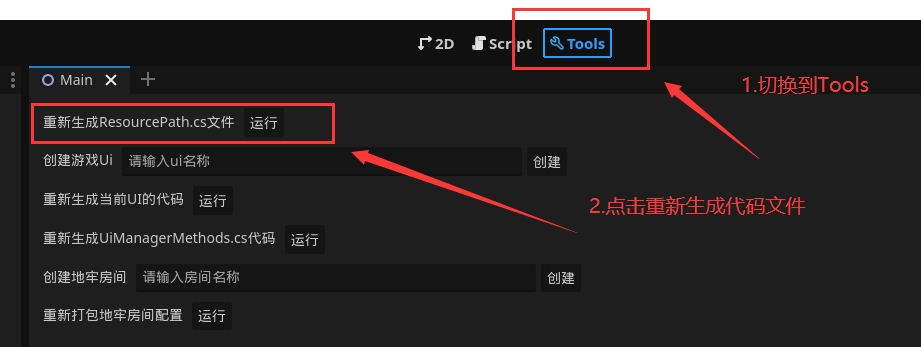
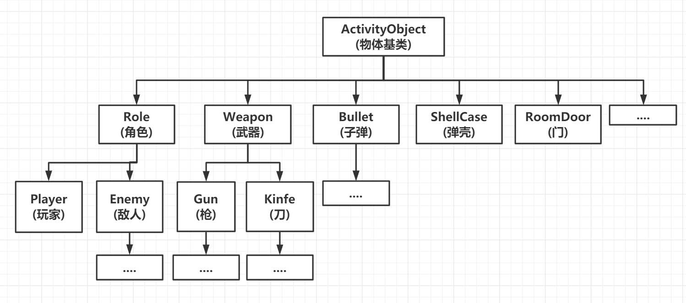
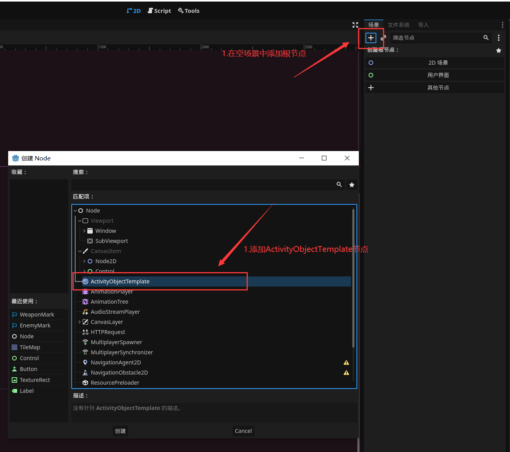
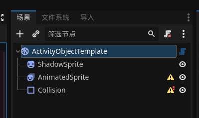
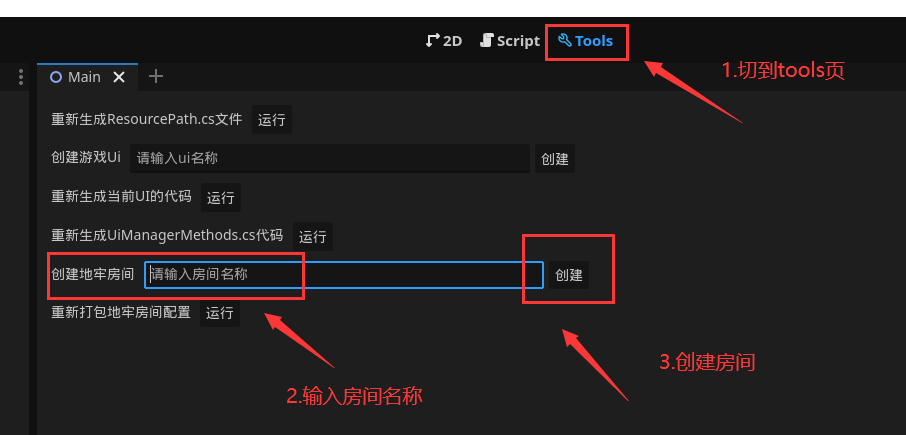
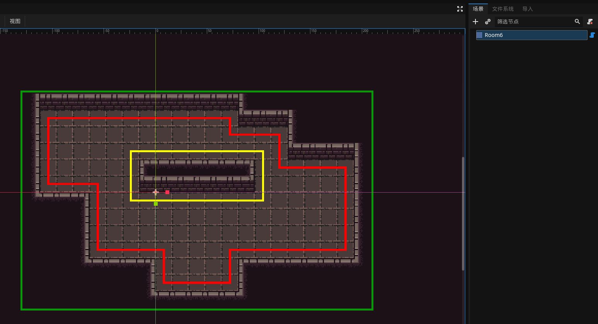
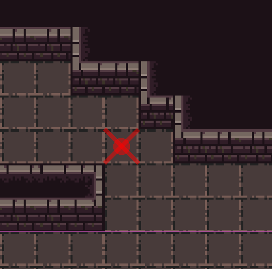
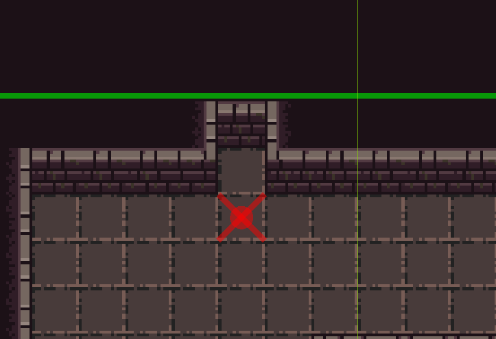

前言: 该文档仅针对`DungeonShooting_Godot`目录下的Godot工程

---
## 1.启动项目
**Godot版本:** Godot4x   
**.net版本:** .net6.0  
使用Godot打开`project.godot`, 如果是第一次打开项目会弹出一个找不到资源的提示, 这是因为项目没有编译过, 点击Godot右上角`build`, 然后打`开项目设置`, 在`插件`这一个页签下启用`DungeonShooting_plugin`这个插件, 然后项目就可以正常运行了

---
## 2.项目资源

### 2.1.目录结构
所有资源严格划分类别, 并放入指定的文件夹  
**项目目录结构如下:**
* ./addons: 项目插件目录  
* ./prefab: 预制体资源目录  
* ./resource 美术,音乐,配置文件等资源放置路径  
* ./scene 场景资源  
* ./src 代码资源

### 2.2.脚本获取资源
为了方便代码获取资源以及排除代码中引用丢失资源的情况, 项目中使用`ResourcePath`类来放置所有资源路径, 该类常量值即代表资源路径, 使用`ResourceManager.Load()`来加载资源  
举个例子, 某资源在编辑器中的路径为: 
```text
res://resource/theme/mainTheme.tres
```
那么在`ResourcePath`中的代码就为:
```csharp
public const string resource_theme_mainTheme_tres = "res://resource/theme/mainTheme.tres";
```
加载该资源的代码为:
```csharp
var resource = ResourceManager.Load<Theme>(ResourcePath.resource_theme_mainTheme_tres);
```

### 2.3.重新生成`ResourcePath`
如果项目中有资源变动, 则可以使用`Tools`页签下的`重新生成ResourcePath.cs文件`  


---
## 3.游戏框架
### 3.1.简述
游戏框架分为三部分:
1. 游戏核心系统
2. UI模块系统
3. 代码生成系统

**游戏核心系统**: 以游戏玩法为中心的逻辑代码, 包括玩家, 敌人, 武器, 被动, 道具, 地牢生成, 房间规则, 存档逻辑等  
**UI模块系统**: 用户操作界面的逻辑代码  
**代码生成系统**: 自动生成便于开发的资源的逻辑代码, 包括生成UI模板, 生成地牢模板, 生成代码等  

### 3.2.游戏核心系统

#### 3.2.1.什么是`ActivityObject`
定义: 游戏内所有可活动物体的基类叫做`ActivityObject`  

`ActivityObject`的意由来: 为了方便统一管理物体, 并且减少子类代码沉积, 因此将所有活动物体都需要用到的逻辑抽到一个统一的类中, 并命名为`ActivityObject`, 所有的活动物体都需要继承该类   

`ActivityObject`提供的基础功能:
* `Component`组件管理
* 协程功能
* 外力控制运动
* 纵轴运动模拟 (自由落体, 投抛物体等)
* 数据标记
* 对象归属区域
* 互动逻辑接口

通过下面这张图可以了解游戏中的物体与`ActivityObject`的关系 (注意: 该图为早期开发版本的继承关系图, 后面开发可能会有修改)  


#### 3.2.2.什么是`Activity模板场景`
定义: `Activity模板场景`是指可以可以被实例化出`ActivityObject`对象的场景, 但是场景根节点必须是`ActivityObjectTemplate`节点  

上面定义看起来有矛盾: `ActivityObjectTemplate`没有继承`ActivityObject`, 为啥以它为根节点的场景却能实例化出`ActivityObject`?  
这就得提到一个概念: **场景与脚本分离**, 顾名思义, 场景中的节点与`ActivityObject`的脚本是完全分离的, 场景中的节点并没有挂载`ActivityObject`脚本, 在编辑器中它们是两互不干涉的.  
游戏运行中, 如果需要实例化`ActivityObject`, 那么就先需要在`ActivityObject`脚本代码中指定该物体的模板场景, 实例化过程中游戏会先实例化出模板场景, 再用`ActivityObject`的实例顶替掉模板场景的根节点, 因此就能打到最终的效果.
为什么要这么做? 原因很简单, 因为我们的游戏是一个Roguelite游戏, 因此游戏中肯定会有大量的武器道具和敌人来填充内容, 但是总会有类似功能或者类似场景结构的物体, 这样就没有必要每一个物体都新建一个单独的场景, 而是让功能让这些类似功能或者结构的物体使用同一个场景, 但为了因对有不同行为逻辑的物体, 我们就设计了一套**场景与脚本分离**的设计模式来因对上述情况  
总结: `Activity模板场景`是不挂载逻辑脚本的, 但是`ActivityObject`必须包含使用的模板场景, 并由统一的Api来实例化`ActivityObject`对象, 至于`ActivityObject`如何绑定模板场景, 请看: 3.2.3.如何创建一个`ActivityObject`

通过下面这张图可以更好的立即`Activity模板场景`和`ActivityObject`的关系  
(缺张图...)

#### 3.2.3.如何创建`ActivityObject`
这里的创建分为两步:  
##### 第一步, 创建模板场景: 
创建一个空场景, 并且添加`ActivityObjectTemplate`节点  
  
创建完成后编辑器会自动创建必要的子节点  
  
此时就可以随意添加子节点和重命名更节点了, 最后记得保存到`./prefab`文件夹下  
**注意**: `ShadowSprite`,`AnimatedSprite`,`Collision`这三个节点不能改名, 但是可以修改属性和添加子节点

##### 第二步, 创建脚本:   
创建脚本放到在`./src/game`下, 脚本必须继直接或间接承`ActivityObject`, 并且需要在类上加`[RegisterActivity(id, path)]`标记用于注册对象, `物体id`必须唯一  
参考代码如下:  
```csharp
using Godot;

[RegisterActivity("物体唯一Id", "模板场景路径")]
public partial class YourActivity : ActivityObject
{
	
}
```
为了方便区分物体类型, 可以使用`ActivityIdPrefix`类中的常量来添加`id`前缀, 目前支持的类型如下:  
* **Role**: 角色
* **Enemy**: 敌人
* **Weapon**: 武器
* **Bullet**: 子弹
* **Shell**: 弹壳
* **Other**: 其他类型, 例如门, 箱子等
* **Test**: 测试物体

例如我们创建一个敌人, 那么`[RegisterActivity()]`就可以这么写:
```csharp
[RegisterActivity(ActivityIdPrefix.Enemy + "0001", ResourcePath.prefab_role_Enemy_tscn)]
```

##### 实例化`ActivityObject`
可通过`ActivityObject.Create(id)`创建物体, 这个`id`可以结合`ActivityIdPrefix`, 那么创建敌人最终可以这样写
```csharp
var enemy = ActivityObject.Create<Enemy>(ActivityIdPrefix.Enemy + "0001");
```

#### 3.2.4.自定义`RegisterActivity`
某些情况下需要更改`RegisterActivity`的参数, 或者需要对实例化出来的`ActivityInstance`进行统一的操作, 那么就需要我们自己写一个子类来继承`RegisterActivity`.  
操作`ActivityInstance`需要重写:
```csharp
/// <summary>
/// 该函数在物体实例化后调用, 可用于一些自定义操作, 参数为实例对象
/// </summary>
public virtual void CustomHandler(ActivityObject instance)
{
}
```

例子: 注册武器, [RegisterWeapon.cs](../DungeonShooting_Godot/src/game/item/weapon/RegisterWeapon.cs)  
由于创建武器必须指定武器属性数据, 那么原来的`[RegisterActivity()]`就不适用了, `RegisterWeapon`重写了构造函数, 改变了初始化参数, 并且重写`CustomHandler()`, 对`ActivityInstance`进行初始化属性操作

#### 3.2.5.`ActivityObject`常用功能

##### 自定义组件
这个功能类似于`Unity`的`MonoBehaviour`, 组件必须继承`Component`类, 组件的作用是拆分功能代码, 开发者可以将相同功能的代码放入同一个组件中, 与`Godot`的`Node`不同的是, 挂载到`ActivityObject`上的组件并不会生成一个`Node`节点, 它相比于`Node`更加轻量

自定义组件代码:  
```csharp
public class MyComponent : Component
{
    
}
```
调用`ActivityObject.AddComponent()`添加组件:
```csharp
var component = activityInstance.AddComponent<MyComponent>();
```
注意: 一个`ActivityObject`上不允许挂载多个相同的组件

##### 运动控制
`ActivityObject`的移动由自身的`MoveController`组件控制, 非特殊情况下不要直接修改`ActivityObject`的位置, 而是使用`MoveController.AddConstantForce()`函数来添加外力
```csharp
//添加一个向右的外力, 速度为100
var force = activityInstance.MoveController.AddConstantForce("ForceName"); //外力必须起名称, 而且在运动控制器中必须唯一
force.Velocity = new Vector2(0, 100);
//以下为精简写法
var force = activityInstance.MoveController.AddConstantForce(new Vector2(0, 100), 0); //创建匿名外力, 但是与上面不同的是当速率变为 0 时自动销毁
```
物体的运动方向就是所有外力总和的方向, 通过`MoveController.Velocity`可以获取当前运动速度

##### 垂直方向运动
当游戏中需要制作飞行物体或者模拟投抛运动时, 就需要控制物体纵轴所处高度, `ActivityObject`中提供了一系列控制纵轴方向运动的属性和函数, 以下列举几个关键属性和函数:  
```csharp
/// <summary>
/// 当前物体的海拔高度, 如果大于0, 则会做自由落体运动, 也就是执行投抛代码
/// </summary>
public float Altitude { get; set; } = 0;

/// <summary>
/// 物体纵轴移动速度, 如果设置大于0, 就可以营造向上投抛物体的效果, 该值会随着重力加速度衰减
/// </summary>
public float VerticalSpeed { get; set; } = 0;

/// <summary>
/// 物体下坠回弹的强度
/// </summary>
public float BounceStrength { get; set; } = 0.5f;

/// <summary>
/// 物体下坠回弹后的运动速度衰减量
/// </summary>
public float BounceSpeed { get; set; } = 0.75f;

/// <summary>
/// 是否启用垂直方向上的运动模拟, 默认开启, 如果禁用, 那么下落和投抛效果, 同样 Throw() 函数也将失效
/// </summary>
public bool EnableVerticalMotion { get; set; } = true;
```
垂直运动也提供了一些可供重写的虚函数:
```csharp
/// <summary>
/// 开始投抛该物体时调用
/// </summary>
protected virtual void OnThrowStart()
{
}

/// <summary>
/// 投抛该物体达到最高点时调用
/// </summary>
protected virtual void OnThrowMaxHeight(float height)
{
}

/// <summary>
/// 投抛状态下第一次接触地面时调用, 之后的回弹落地将不会调用该函数
/// </summary>
protected virtual void OnFirstFallToGround()
{
}

/// <summary>
/// 投抛状态下每次接触地面时调用
/// </summary>
protected virtual void OnFallToGround()
{
}

/// <summary>
/// 投抛结束时调用
/// </summary>
protected virtual void OnThrowOver()
{
}
```
如果需要模拟飞行效果则需要设置`Altitude`值大于0, 并且将`EnableVerticalMotion`设置为`false`  
如果需要自由落体, 则直接设置`Altitude`值大于0  
如果需要上抛运动, 则直接设置`VerticalSpeed`值大于0   
如果值`BounceStrength`和`BounceSpeed`设置成1, 则投抛的物体在地上会一直朝一个方向弹跳  
如果需要投抛物体不需要每个关键值都设置一遍信息, 只需要调用`ActivityObject.Throw()`函数即可:
```csharp
/// <summary>
/// 将该节点投抛出去
/// </summary>
/// <param name="altitude">初始高度</param>
/// <param name="rotate">旋转速度</param>
/// <param name="velocity">移动速率</param>
/// <param name="verticalSpeed">纵轴速度</param>
public void Throw(float altitude, float verticalSpeed, Vector2 velocity, float rotate);
```
调用示例, 模拟弹壳投抛落在地上弹跳的过程
```csharp
var startPos = GlobalPosition;
var startHeight = 6;
var direction = GlobalRotationDegrees + Utils.RandomRangeInt(-30, 30) + 180;
var verticalSpeed = Utils.RandomRangeInt(60, 120);
var velocity = new Vector2(Utils.RandomRangeInt(20, 60), 0).Rotated(direction * Mathf.Pi / 180);
var rotate = Utils.RandomRangeInt(-720, 720);
var shell = ActivityObject.Create<ShellCase>(ActivityIdPrefix.Shell + "0001");
shell.Throw(startPos, startHeight, verticalSpeed, velocity, rotate);
```

##### 协程
该功能与`Unity`的协程功能类似, 在协程函数中通过`yield`关键字暂停执行后面的代码, 并将控制权返还给`ActivityObject`, 协程常被用在动画处理和资源异步加载  
`ActivityObject`中协程相关函数:  
```csharp
/// <summary>
/// 开启一个协程, 返回协程 id, 协程是在普通帧执行的, 支持: 协程嵌套, WaitForSeconds, WaitForFixedProcess
/// </summary>
public long StartCoroutine(IEnumerator able);

/// <summary>
/// 根据协程 id 停止协程
/// </summary>
public void StopCoroutine(long coroutineId);

/// <summary>
/// 停止所有协程
/// </summary>
public void StopAllCoroutine();
```
协程`yield return`返回特殊值类型如下:  
* **WaitForSeconds**: 当前协程等待秒数
* **WaitForFixedProcess**: 当前协程等待帧数
* **IEnumerator**: 嵌套执行子协程, 等子协程执行完毕后才会继续执行后面的代码

协程`yield return`如果返回除以上数据类型以外的数据, 将忽略返回值  

调用实例, 以下代码在`ActivityInstance`初始化时执行协程`StartRotation`, 协程在60帧内让物体每帧角度加1
```csharp
public override void OnInit()
{
    StartCoroutine(StartRotation());
}

private IEnumerator StartRotation()
{
    for (int i = 0; i < 60; i++)
    {
        RotationDegrees += 1;
        //结束这一帧, 返回0会被忽略返回值
        yield return 0;
    }
}
```

### 3.3.地牢
#### 3.3.1.地牢概述
游戏中的地牢由若干层组成, 每一层地牢又由数个小房间随机拼接而成, 由起始房间开始, 成树状连接; 每一层地牢有一个起始房间, 和至少一个通向另一层的结束房间, 房间与房间之间由过道连接, 过道不会交叉和重叠  

房间有以下类别 (目前代码还未完成区分类型的功能):
* **起始房间**: 由上一层地牢的结束房间进入该房间, 每层包含一个起始房间
* **结束房间**: 进入另一层地牢, 每层只是包含一个结束房间
* **普通战斗房间**: 进入该房间时会关上门, 并刷出若干波敌人, 消灭所有敌人后开门
* **boss战房间**: 进入房间时会关上没, 刷出boss, 消灭boss后开门
* **奖励房间**: 给予玩家武器或者道具奖励的房间
* **商店**: 玩家买卖道具装备的房间
* **事件房间**: 触发剧情或者解锁NPC的房间

#### 3.3.2.创建模板房间
图块层级概述(后续补上)

##### 创建模板房间
项目提供了一套创建模板房间的工具, 点击`tools`页签, 找到`创建地牢房间`这一项, 输入模板房间名称(注意房间名称不能重复), 即可创建房间, 创建房间完成后会创建房间配置数据, 路径为`resource/map/tiledata/xxx.json`, 并将配置数据注册到`resource/map/RoomConfig.json`中


##### 绘制房间
创建好的房间会自动在编辑器中打开, 为场景的根节点选好`TileSet`后就可以画房间了  

编辑器会自动计算出房间位置轮廓(绿色线)和导航区域(红色和黄色线), 并绘制出来, 按下`ctrs`+`s`, 编辑器就会将位置轮廓和导航信息存入`resource/map/tiledata/xxx.json`下  
注意, 为了避免Ai运动时卡墙角, 所以计算导航轮廓时特意与墙预留了半个格子的距离, 也就是说如果存在单格的道路, 导航计算就会出错, 所以在画道路时必须为两格以上的宽度, 像下面这两种情况就是不被允许的, 编辑器会绘制出错误的格子


如果计算导航网格出错, 那么编辑器将不会保存房间配置信息

##### 配置房间门生成位置

### 3.4.UI系统
#### 3.4.1.UI系统概述

#### 3.4.2.UI代码生器

#### 3.4.3.常用功能