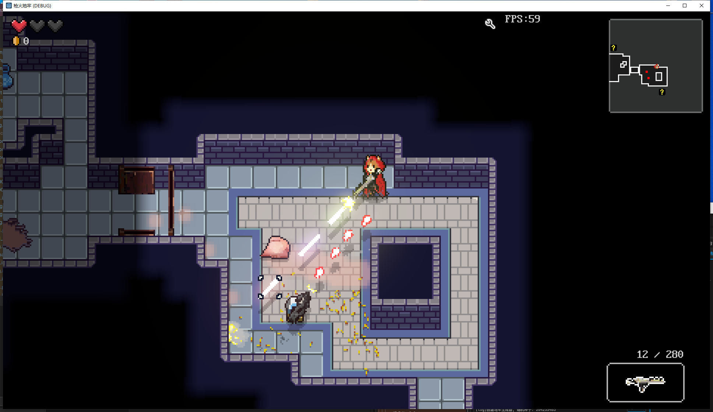
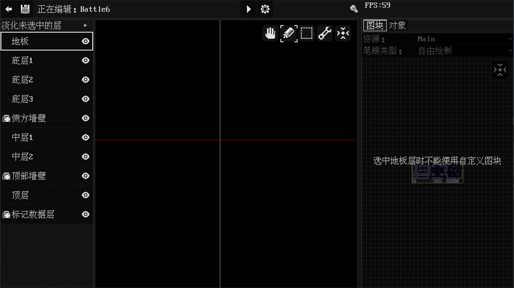
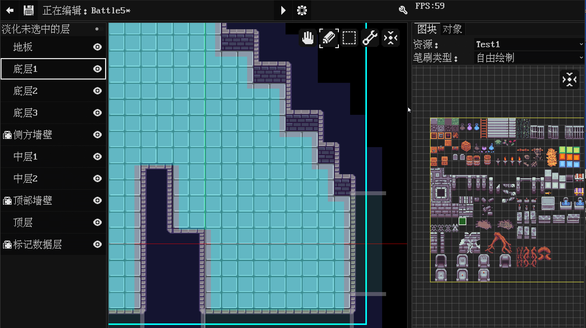
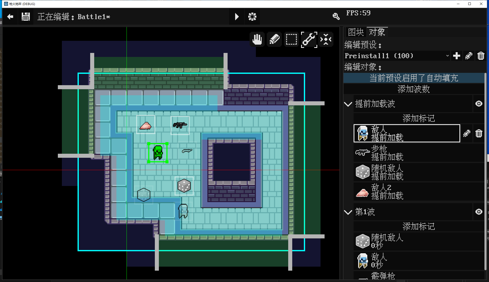
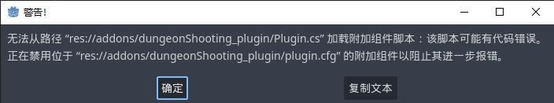
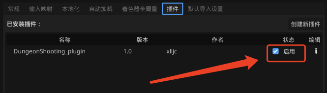

## 一款由Godot开发的地牢射击类型的游戏

**Godot版本:** `4.2.1 mono`  
**.Net版本:** `8.0`

---
### 游戏定义

**游戏名称:**《枪火地牢》  
**英文名称:**《Gunfire Dungeon》  
**美术风格:** 2D像素(完美像素)  
**游戏标签:** Roguelite, 俯视角, 地牢探索, 双摇杆射击  
**参考游戏:** 《挺进地牢》, 《元气骑士》, 《废土之王》  
**核心简介:** 游戏整体流程由数层地牢组成, 每层又由数个房间组成, 每个房间有一堵门隔开, 玩家每进入一个房间, 需要清理房间内所有的敌人, 方可离开和进入下一个房间,
玩家需要在这些房间中探索, 战斗, 收集掉落的道具和被动, 一步步成长, 击败boss, 进入下一层, 如此往复, 直到击败最后一层boss即可通关.
但本作与市面上常规地牢射击游戏不同的是, 玩家与敌人共用武器资源, 玩家击败敌人便可拾起敌人的武器, 并且更加注重环境互动要素  
**游戏背景:** 构思中

**游戏内置了一个功能强大的地图编辑器, 方便玩家自己制作地图和分享地图**

---
### 预览图
##### 游戏中  
  
  
##### 地图编辑器  
房间管理器  
  
房间地形编辑  
  
房间装饰编辑  
  
房间预设编辑

---
### 启动项目

git仓库的目录结构如下
> ├ DungeonShooting_Document (更新日志相关的目录)  
> └ DungeonShooting_Godot (Godot工程目录)

请确保安装了`.net8`和`godot mono4.2.1`

godot下载地址: https://godotengine.org/download

.net8下载地址: https://dotnet.microsoft.com/zh-cn/download/dotnet/8.0

使用GodotMono版打开`DungeonShooting_Godot/project.godot`

**注意**: 如果是第一次打开项目会弹出以下提示

这是因为项目没有编译过, 点击Godot右上角`build`, 然后打`开项目设置`, 在`插件`这一个页签下启用`DungeonShooting_plugin`这个插件

最后重启编辑器, 项目就可以正常运行了

---
### 其他

**开发日志:** [开发日志.md](DungeonShooting_Document/开发日志.md)  
**哔哩哔哩:** https://space.bilibili.com/259437820  
**项目Ui插件:** https://github.com/xlljc/Ds_Ui